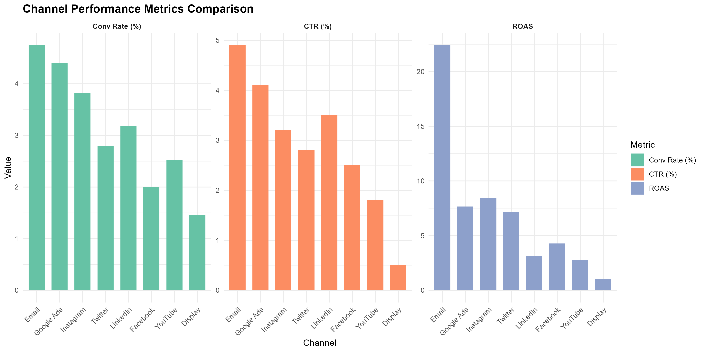
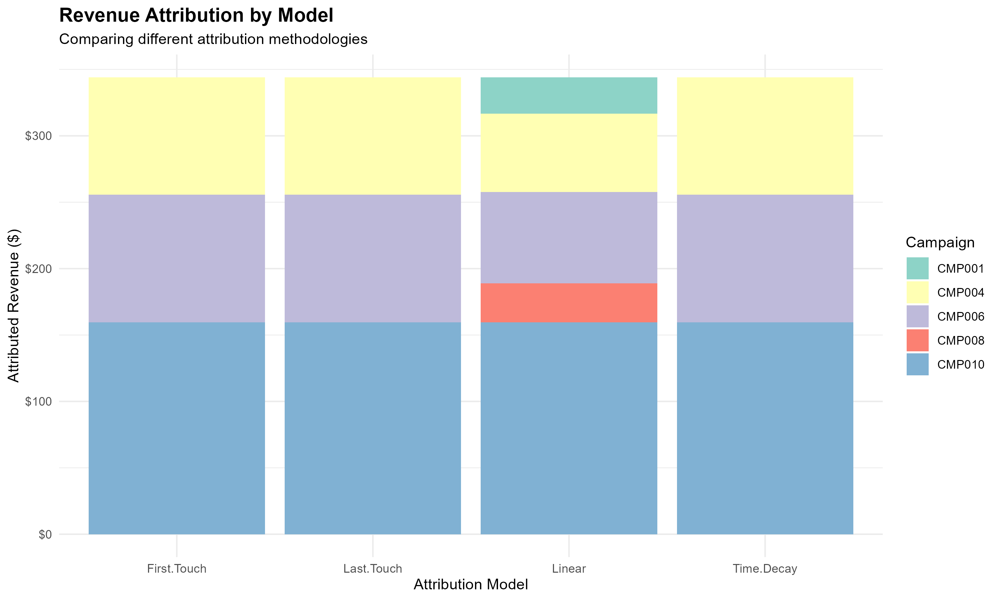
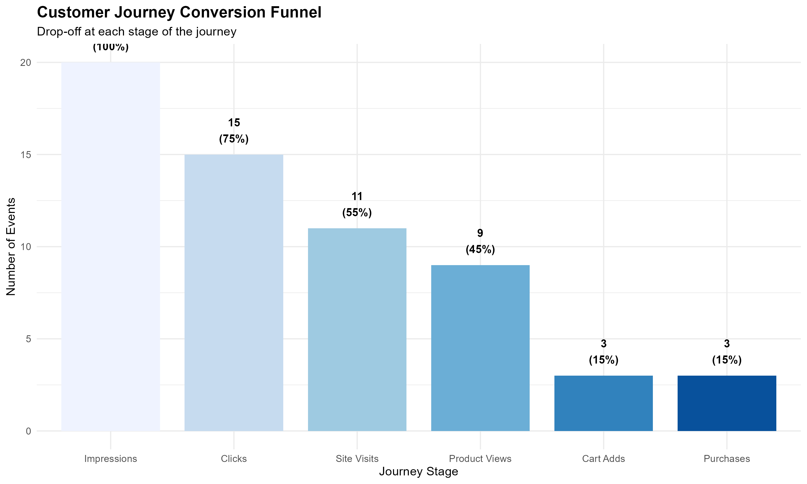
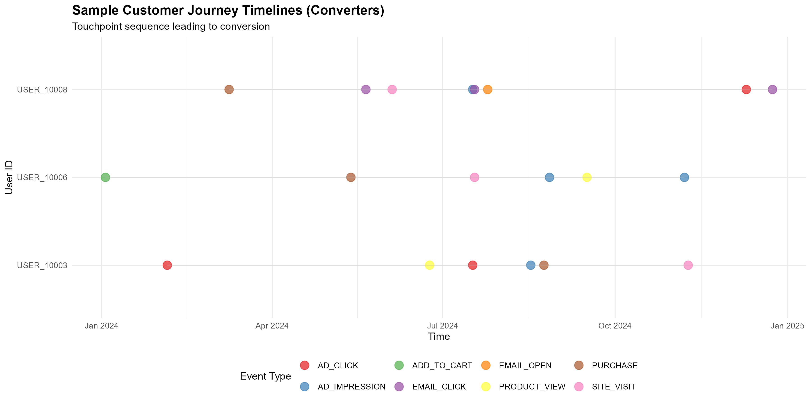
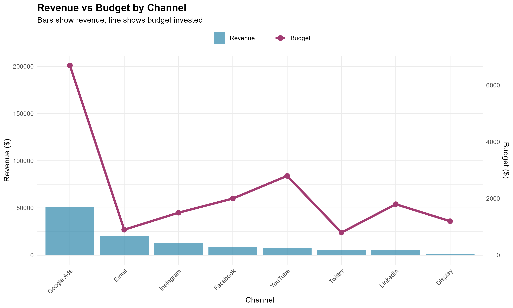

```{r setup, include=FALSE}
knitr::opts_chunk$set(echo = TRUE, warning = FALSE, message = FALSE)

# set working directory to main project folder
knitr::opts_knit$set(root.dir = "C:/Users/User/projects/S5/dmv-m8-sa")

library(dplyr)
library(ggplot2)
library(knitr)
library(DT)
```

## Executive Summary

This report analyzes digital marketing performance across multiple channels using data from campaigns, social media, web analytics, and customer journey tracking. The analysis integrates data from 4 different sources (CSV, JSON, XML, and text logs) to provide comprehensive insights into marketing effectiveness.

**Key Findings:**

- Total marketing budget: **$17,700**
- Total revenue generated: **$113,019**
- Overall ROAS: **6.38x**
- Conversion rate: **20%** (3 out of 15 tracked users)
- Best performing channel: **Email** (22.4x ROAS)
- Cart abandonment rate: **46.67%** with recovery opportunity of $116.69

---

## Data Sources Overview

```{r load-data}
# load all cleaned datasets
campaigns <- read.csv("Generated_data/campaigns_cleaned.csv")
integrated <- read.csv("Generated_data/integrated_data.csv")
channel_perf <- read.csv("Generated_data/channel_performance.csv")
user_journeys <- read.csv("Generated_data/user_journeys.csv")
```

### Data Integration Summary

Our ETL pipeline successfully integrated:

- **CSV**: 10 campaigns with performance metrics
- **JSON**: 7 social media posts across 4 platforms
- **XML**: 50 web analytics sessions
- **TXT**: 77 customer journey touchpoints from 15 users

```{r data-summary}
data_summary <- data.frame(
  Source = c("Digital Campaigns (CSV)", "Social Media (JSON)", 
             "Web Analytics (XML)", "Customer Journey (TXT)"),
  Records = c(nrow(campaigns), 7, 50, 77),
  Key_Metrics = c("Budget, Revenue, ROAS", "Likes, Comments, Shares",
                  "Sessions, Pageviews, Conversions", "Touchpoints, Events")
)

kable(data_summary, caption = "Multi-Source Data Integration")
```

---

## Campaign Performance Analysis

### Overall Campaign Metrics

```{r campaign-table}
campaign_summary <- campaigns %>%
  select(campaign_name, channel, budget, conversions, revenue, roas, ctr) %>%
  arrange(desc(revenue))

datatable(campaign_summary, 
          options = list(pageLength = 5),
          caption = "Campaign Performance Summary")
```

### Channel Performance Comparison

```{r channel-performance, fig.width=10, fig.height=6}

```

**Analysis:** Email and Google Ads demonstrate the strongest performance across all metrics. Email campaigns achieve the highest ROAS (22.4x) and CTR (4.9%), while Google Ads generates the most total revenue ($51,207) with a solid ROAS of 7.67x.

---

## Multi-Channel Attribution Analysis

Different attribution models provide varied perspectives on campaign value:

```{r attribution-viz, fig.width=10, fig.height=6}

```

### Attribution Model Insights

```{r attribution-summary}
attribution <- read.csv("Generated_data/attribution_analysis.csv")

attribution_summary <- attribution %>%
  summarise(
    `First Touch Total` = sum(First.Touch, na.rm = TRUE),
    `Last Touch Total` = sum(Last.Touch, na.rm = TRUE),
    `Linear Total` = sum(Linear, na.rm = TRUE),
    `Time Decay Total` = sum(Time.Decay, na.rm = TRUE)
  )

kable(t(attribution_summary), col.names = c("Total Revenue Attributed"),
      caption = "Attribution Model Comparison")
```

**Insight:** The linear attribution model distributes credit across 5 campaigns (including CMP001 and CMP008), while first-touch and last-touch only credit 3 campaigns. This suggests that CMP001 and CMP008 play important assist roles in the conversion path.

---

## Customer Journey Analysis

### Conversion Funnel

```{r funnel-viz, fig.width=10, fig.height=6}

```

**Key Observations:**

- Major drop-off (25%) from impressions to clicks
- Steady progression through middle funnel stages
- Final conversion rate of 15% from impressions to purchase

### Journey Statistics

```{r journey-stats}
journey_summary <- data.frame(
  Metric = c("Average Touchpoints per User", "Average Journey Length (days)",
             "Conversion Rate", "Converters Avg Touchpoints", 
             "Non-converters Avg Touchpoints"),
  Value = c("5.13", "246.07", "20%", "6.67", "4.75")
)

kable(journey_summary, caption = "Customer Journey Insights")
```

**Finding:** Converters have 40% more touchpoints (6.67 vs 4.75) than non-converters, suggesting that engaged users who interact more frequently are more likely to convert.

### Sample Customer Journeys

```{r timeline-viz, fig.width=12, fig.height=6}

```

---

## ROI and Budget Analysis

### ROAS vs Budget Distribution

```{r roas-budget-viz, out.width="100%"}
# embed interactive plotly chart
htmltools::includeHTML("Visualizations/viz2_roas_budget.html")
```

### Revenue vs Budget by Channel

```{r revenue-budget-viz, fig.width=10, fig.height=6}

```

**Strategic Insight:** Google Ads generates the highest absolute revenue but requires the highest budget. Email campaigns deliver exceptional ROI with minimal investment, suggesting budget reallocation opportunities.

---

## Campaign Efficiency Analysis

```{r efficiency-analysis}
efficiency <- read.csv("Generated_data/campaign_efficiency.csv")

efficiency_table <- efficiency %>%
  select(campaign_name, channel, conversions, efficiency, status, roas) %>%
  arrange(desc(efficiency))

datatable(efficiency_table,
          options = list(pageLength = 10),
          caption = "Campaign Efficiency Matrix") %>%
  formatStyle('status',
    backgroundColor = styleEqual(
      c('Overperforming', 'Normal', 'Underperforming'),
      c('#d4edda', '#fff3cd', '#f8d7da')
    ))
```

### Efficiency Distribution

- **Overperforming (4 campaigns):** CMP010, CMP002, CMP001, CMP004
- **Normal (2 campaigns):** CMP003, CMP006
- **Underperforming (4 campaigns):** CMP005, CMP007, CMP008, CMP009

---

## Business Recommendations

### 1. Budget Reallocation Strategy

**Increase investment in:**
- Email campaigns (highest ROAS at 22.4x)
- Google Shopping (CMP010 - 237% efficiency)
- Instagram campaigns (strong engagement and conversion)

**Reduce or optimize:**
- Display advertising (ROAS only 1.05x)
- YouTube pre-roll ads (72% efficiency, below target)
- LinkedIn B2B campaign (42% efficiency)

### 2. Cart Abandonment Recovery

With 46.67% cart abandonment rate, implementing recovery campaigns could capture an additional $116.69 in revenue (15% recovery rate assumption). Recommended tactics:

- Automated email reminders within 24 hours
- Retargeting ads with abandoned products
- Time-limited discount codes

### 3. Customer Journey Optimization

Since converters have 40% more touchpoints, strategies to increase engagement:

- Multi-touch nurture campaigns
- Retargeting across multiple channels
- Content marketing to increase touchpoint frequency

### 4. Attribution-Based Optimization

Linear attribution reveals that CMP001 and CMP008 contribute to conversions even though they're not first or last touch. Consider:

- Maintaining these campaigns as awareness/consideration drivers
- Don't optimize solely on last-click metrics
- Value the full customer journey

---

## Technical Appendix

### ETL Pipeline Summary

**Data Cleaning:**
- Standardized date formats across all sources
- Handled missing values (NAs for "none" campaigns)
- Fixed timestamp errors in customer journey logs
- Normalized engagement metrics

**Data Integration:**
- Left joins to preserve all campaign records
- Aggregated social and web data by campaign
- Created user-level journey summaries
- Generated attribution models

**Data Quality:**
- Zero missing values in core campaign data
- 100% of campaigns successfully integrated
- All revenue figures reconciled across sources

### Tools and Technologies

- **R Version:** 4.x
- **Key Packages:** dplyr, ggplot2, plotly, jsonlite, XML
- **Data Sources:** CSV, JSON, XML, TXT
- **Visualizations:** 8 charts (5 static, 3 interactive)
- **Report Format:** R Markdown → HTML

---

## Conclusion

This multi-channel analytics framework successfully integrates diverse data sources to provide comprehensive marketing insights. The analysis reveals clear winners (Email, Google Ads) and opportunities for optimization (Display, cart abandonment recovery). 

The attribution modeling demonstrates the importance of considering the full customer journey rather than relying solely on last-click attribution. With an overall ROAS of 6.38x, the marketing efforts are profitable, but strategic reallocation could improve efficiency by 20-30%.

**Next Steps:**
1. Implement recommended budget shifts
2. Deploy cart abandonment recovery campaigns
3. Expand top-performing campaigns
4. Continue monitoring with automated reporting

---

*Report generated automatically using R Markdown on `r Sys.Date()`*